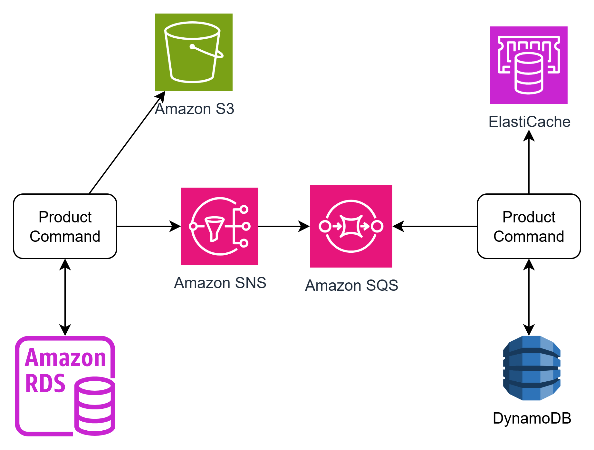

# Product Command

This microservice is part of the PoC that implements the Command Query Responsibility Segregation **(CQRS)** pattern.

The main technologies used are:
- Go
- Fiber
- AWS SDKs (S3 and SNS)

The command service has teo endpoints 

1. **Generate Signed URLs** so that the client can upload images to AWS S3

2. **Create a product**, which will be saved in AWS RDS, after that, a message is published to SNS so that the query microservice can replicate the information